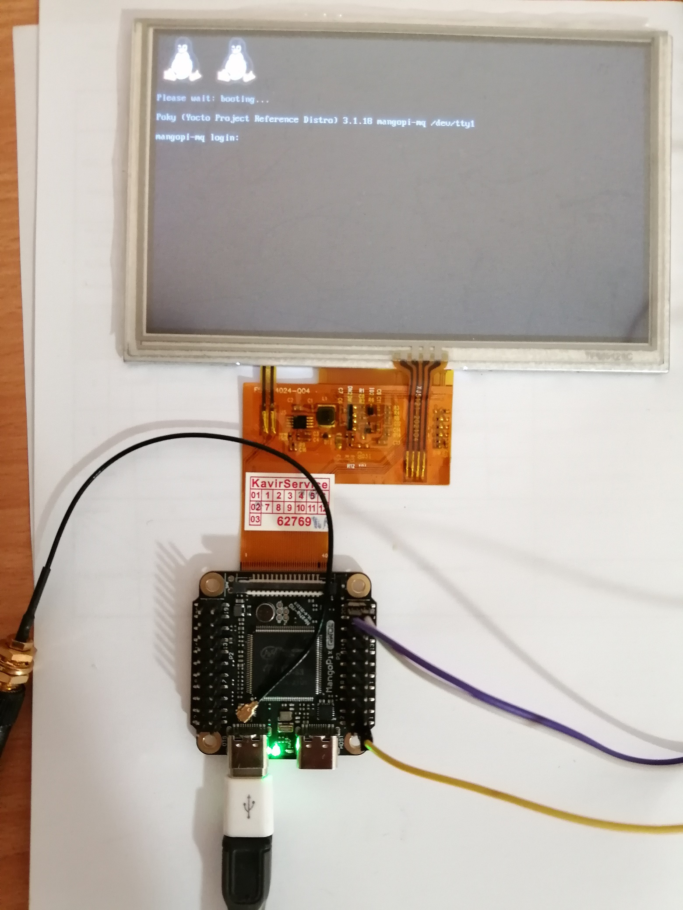

# Introduction 
This is BSP layer for [Mangopi-MQ](https://mangopi.org/mangopi_mq) which uses _T113-S3_ SoC.

# Getting started
1. Clone required layers:
```bash
git clone git://git.yoctoproject.org/poky -b dunfell
cd poky/
git clone git://git.yoctoproject.org/meta-arm -b dunfell
git clone https://github.com/openembedded/meta-openembedded.git -b dunfell
git clone https://github.com/meta-qt5/meta-qt5.git -b dunfell
git clone https://github.com/ArashEM/meta-mangopi.git -b dunfell
cd ../
```
2. Export template configuraiton path and initialize build envrionment
```bash
export TEMPLATECONF=${TEMPLATECONF:-meta-mangopi/conf}
source poky/oe-init-build-env mangopi-mq
```
3. Start build process
```bash
bitbake qt5-image
bitbake -c do_populate_sdk qt5-image
```
4. Flash `wic` image into your SD card
```bash
sudo dd if=tmp/deploy/images/mangopi-mq/qt5-image-mangopi-mq.wic of=/dev/sdX
```
5. Enjoy :-)

# View
Here is what it looks like (using 800x480 LCD)


# ToDo
1. There is no driver for `TPADC`. So with current LCD (40pin FPC with integrated resistive touch scree) touch screen is not available (for now!)
2. Enabling `tve` causes issue with `RGB` interface. When `tve` was enabled, `RGB` interface size and referesh rate was not correct. For example enabling `tve` make display pipeline like this
```
root@mangopi-mq:/sys/kernel/debug/dri/0# cat state
plane[31]: plane-0
        crtc=(null)
        fb=0
        crtc-pos=0x0+0+0
        src-pos=0.000000x0.000000+0.000000+0.000000
        rotation=1
        normalized-zpos=0
        color-encoding=ITU-R BT.709 YCbCr
        color-range=YCbCr limited range
plane[37]: plane-1
        crtc=crtc-0
        fb=66
                allocated by = [fbcon]
                refcount=3
                format=XR24 little-endian (0x34325258)
                modifier=0x0
                size=800x480
                layers:
                        size[0]=800x480
                        pitch[0]=3200
                        offset[0]=0
                        obj[0]:
                                name=0
                                refcount=2
                                start=00010000
                                size=1536000
                                imported=no
                                dma_addr=0x41a00000
                                vaddr=4ad5ec0c
        crtc-pos=800x480+0+0
        src-pos=800.000000x480.000000+0.000000+0.000000
        rotation=1
        normalized-zpos=0
        color-encoding=ITU-R BT.601 YCbCr
        color-range=YCbCr limited range
plane[44]: plane-2
        crtc=crtc-1
        fb=66
                allocated by = [fbcon]
                refcount=3
                format=XR24 little-endian (0x34325258)
                modifier=0x0
                size=800x480
                layers:
                        size[0]=800x480
                        pitch[0]=3200
                        offset[0]=0
                        obj[0]:
                                name=0
                                refcount=2
                                start=00010000
                                size=1536000
                                imported=no
                                dma_addr=0x41a00000
                                vaddr=4ad5ec0c
        crtc-pos=720x480+0+0
        src-pos=720.000000x480.000000+0.000000+0.000000
        rotation=1
        normalized-zpos=0
        color-encoding=ITU-R BT.709 YCbCr
        color-range=YCbCr limited range
crtc[41]: crtc-0
        enable=1
        active=1
        self_refresh_active=0
        planes_changed=1
        mode_changed=0
        active_changed=0
        connectors_changed=0
        color_mgmt_changed=0
        plane_mask=2
        connector_mask=1
        encoder_mask=1
        mode: "800x480": 60 33300 800 1010 1011 1057 480 502 503 526 0x48 0x0
crtc[50]: crtc-1
        enable=1
        active=1
        self_refresh_active=0
        planes_changed=1
        mode_changed=0
        active_changed=0
        connectors_changed=0
        color_mgmt_changed=0
        plane_mask=4
        connector_mask=2
        encoder_mask=2
        mode: "720x480i": 60 13500 720 736 800 858 480 486 492 525 0x48 0x1a
connector[43]: Unknown-1
        crtc=crtc-0
        self_refresh_aware=0
        max_requested_bpc=0
        colorspace=Default
connector[52]: Composite-1
        crtc=crtc-1
        self_refresh_aware=0
        max_requested_bpc=0
        colorspace=Default
```
Not to the `crtc-1`.
But after disabling `tve`, I got this
```
root@mangopi-mq:/sys/kernel/debug/dri/0# cat state
plane[31]: plane-0
        crtc=(null)
        fb=0
        crtc-pos=0x0+0+0
        src-pos=0.000000x0.000000+0.000000+0.000000
        rotation=1
        normalized-zpos=0
        color-encoding=ITU-R BT.709 YCbCr
        color-range=YCbCr limited range
plane[37]: plane-1
        crtc=crtc-0
        fb=51
                allocated by = [fbcon]
                refcount=2
                format=XR24 little-endian (0x34325258)
                modifier=0x0
                size=800x480
                layers:
                        size[0]=800x480
                        pitch[0]=3200
                        offset[0]=0
                        obj[0]:
                                name=0
                                refcount=2
                                start=00010000
                                size=1536000
                                imported=no
                                dma_addr=0x41a00000
                                vaddr=ca5bd4a2
        crtc-pos=800x480+0+0
        src-pos=800.000000x480.000000+0.000000+0.000000
        rotation=1
        normalized-zpos=0
        color-encoding=ITU-R BT.601 YCbCr
        color-range=YCbCr limited range
plane[44]: plane-2
        crtc=(null)
        fb=0
        crtc-pos=0x0+0+0
        src-pos=0.000000x0.000000+0.000000+0.000000
        rotation=1
        normalized-zpos=0
        color-encoding=ITU-R BT.709 YCbCr
        color-range=YCbCr limited range
crtc[41]: crtc-0
        enable=1
        active=1
        self_refresh_active=0
        planes_changed=1
        mode_changed=0
        active_changed=0
        connectors_changed=0
        color_mgmt_changed=0
        plane_mask=2
        connector_mask=1
        encoder_mask=1
        mode: "800x480": 60 33300 800 1010 1011 1057 480 502 503 526 0x48 0x0
crtc[50]: crtc-1
        enable=0
        active=0
        self_refresh_active=0
        planes_changed=0
        mode_changed=0
        active_changed=0
        connectors_changed=0
        color_mgmt_changed=0
        plane_mask=0
        connector_mask=0
        encoder_mask=0
        mode: "": 0 0 0 0 0 0 0 0 0 0 0x0 0x0
connector[43]: Unknown-1
        crtc=crtc-0
        self_refresh_aware=0
        max_requested_bpc=0
        colorspace=Default

```
# More
I want to thanks all contributors of [AWboot](https://github.com/szemzoa/awboot). Their bootloader and kernel patches are directly used in this layer. 
